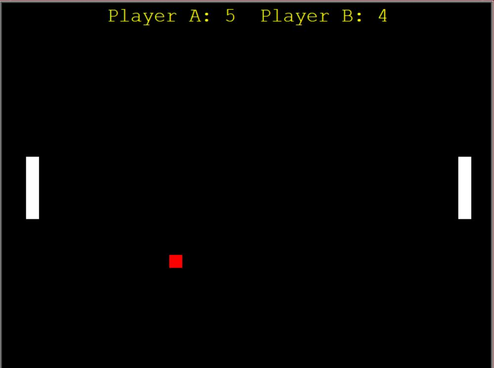

# Pong-game
This is one of the first game to be created in the world,This is a remake of the same using Python's turtle library.THis is a 2-player game and the pads can be controlled using Up/Down and W/S keys for each.

## How to play
Start your game using
```bash
python pong.py
```

## Screenshot

